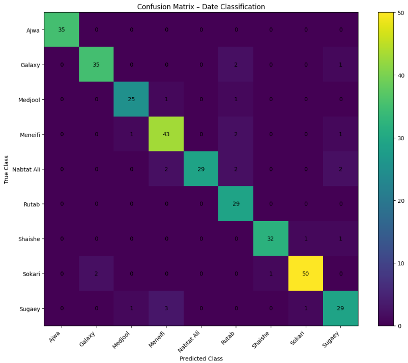

# week4_assignment

# Date Fruit Image Classification Project

This project focuses on classifying images of date fruits into multiple categories using deep learning techniques.  
It was developed as part of **SDAIA Bootcamp – Week 4**, with the goal of applying convolutional neural networks to a real-world image classification task.

---

## Dataset

The dataset used in this project is sourced from Kaggle and consists of date fruit images captured in a **controlled environment**, which helps reduce background noise and allows the model to focus on the visual characteristics of the dates.

- Dataset source:  
  https://www.kaggle.com/datasets/wadhasnalhamdan/date-fruit-image-dataset-in-controlled-environment
- Number of classes: **9 date varieties**
- Data is already labeled and organized by class

The classes included are:
- Ajwa  
- Galaxy  
- Medjool  
- Meneifi  
- Nabtat Ali  
- Rutab  
- Shaishe  
- Sokari  
- Sugaey  

---

## Data Preprocessing and Augmentation

Before training, the following preprocessing steps were applied:
- Image resizing to a fixed input size
- Normalization of pixel values
- Splitting the dataset into training and validation sets

To improve generalization and reduce overfitting, **data augmentation** was applied during training.  
This helps the model become more robust to variations such as changes in orientation and lighting.

---

## Model Used

The model used in this project is **MobileNetV3 (Small)**.

MobileNetV3 was selected because:
- It is lightweight and computationally efficient
- It performs well on image classification tasks
- It is suitable for training with limited resources

---

## Transfer Learning and Model Modification

Transfer learning was applied to leverage the feature extraction capabilities of MobileNetV3.

The following modifications were made:
- The final classification layer was replaced to match the **9 date classes**
- The model was fine-tuned on the date fruit dataset
- The best-performing model weights were saved using `state_dict`

The saved model file:
- `best_model.pth`

---

## Evaluation and Results

The trained model achieved an accuracy of approximately **92%** on the validation set.

To better understand model performance across all classes, a **Confusion Matrix** was generated.

### Confusion Matrix

Below is the confusion matrix visualization showing the model’s predictions versus the true labels:

The confusion matrix shows strong diagonal dominance, indicating that most samples were classified correctly.  
Minor misclassifications occur mainly between visually similar date varieties, which is expected in fine-grained image classification tasks.

---

## Project Files

This repository contains the following files:

- **Assignment files (4 notebooks)**  
  Step-by-step assignments covering data handling, model building, and experimentation during the bootcamp.

- **Project file**  
  The main notebook containing the final training pipeline, evaluation, and results.

- **Model weights file**  
  `best_model.pth` – saved weights of the best-performing trained model.

---

## Conclusion

This project demonstrates the practical application of deep learning and transfer learning for image classification.  
The results show that MobileNetV3, combined with data augmentation and proper preprocessing, can achieve strong performance on date fruit classification tasks.
